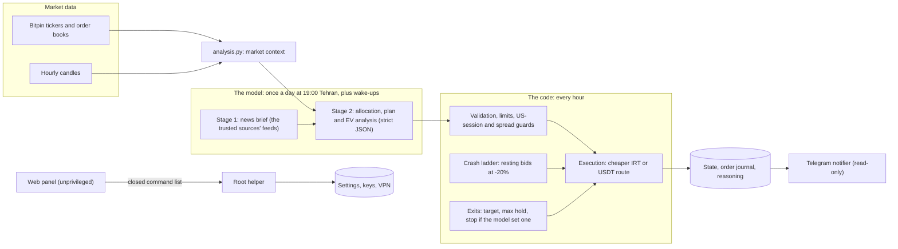

# Bitpin AI Trader

**English** · [فارسی](README_FA.md)

An autonomous trading bot for [Bitpin](https://bitpin.ir), the Iranian crypto exchange. A large language model
decides what the account holds: **Kimi K3** by Moonshot AI by default, or any model on **OpenRouter** or another
OpenAI-compatible API. The code supplies the market data, enforces hard limits and executes the orders. Every
decision and trade is reported in Persian on **Telegram**, and a secure bilingual **web panel** manages the bot.

The bot was built for Bitpin's one-year AI trading competition (2026-09-21 20:30 UTC to 2027-09-21 20:30 UTC),
which is scored on the account value in toman. Its goal is the largest account at the end of the year, with the
risk that implies: the model stays the decision maker, and the code adds discipline and robustness.

| | |
|---|---|
| **Version** | `3.8.1` · release notes in [CHANGELOG.md](CHANGELOG.md) |
| **Runs on** | one Ubuntu server, as three independent systemd services |
| **Dependencies** | none: Python standard library only (Python 3.7 to 3.14) |
| **Tests** | about 1,500 unit and integration tests; no network or real key needed |
| **License** | [MIT](LICENSE) |

> [!WARNING]
> **This software trades real money.** Nothing in it is investment advice; use it at your own risk.
> API keys and tokens are never stored in this repository. On the server they live in root-only files under
> `/etc/bitpin-bot/`.

## Contents

- [Features](#features)
- [How a decision is made](#how-a-decision-is-made)
- [Components](#components)
- [Management panel](#management-panel)
- [Telegram notifier](#telegram-notifier)
- [Safety](#safety)
- [Installation](#installation)
- [Configuration](#configuration)
- [Using OpenRouter or another model](#using-openrouter-or-another-model)
- [Everyday commands](#everyday-commands)
- [Updating and rolling back](#updating-and-rolling-back)
- [Tests](#tests)
- [Repository layout](#repository-layout)
- [Research behind the design](#research-behind-the-design)
- [License](#license)

## Features

- **One decision a day** at 19:00 Tehran time (15:30 UTC, inside the US stock session), plus wake-ups between
  decisions when:
  - a held position moves ±12 %;
  - the drawdown deepens;
  - a crash-ladder bid fills, or a ladder coin falls 15 % (the model may then veto its bids);
  - the competition's final decision is due (2027-09-20).
- **Two model stages.**
  - *News:* the bot reads the latest headlines of a list of trusted sites from their own feeds (RSS, Atom): news
    agencies, crypto media, Iranian economic media and official sources, editable in the panel. A model picks the
    events that matter and summarises them in one JSON request; every item keeps its feed's link and date, and
    items older than a week are dropped. The brief is treated as untrusted text: prices and embedded instructions
    are removed.
  - *Decision:* the decision model returns a strict JSON allocation. Every new position comes with an entry plan
    (setup, horizon, invalidation, optional target or stop) and an expected-value analysis after costs; every
    analysed coin also gets a technical reading by one fixed method (trend, momentum, RSI, Bollinger, Donchian,
    volume, support, resistance) that the code re-checks on the same numbers.
- **53 markets:** USDT, 34 liquid coins and 18 tokenized real-world assets (gold, silver, oil, gas, copper miners,
  US stocks, US equity and bond ETFs). Tokenized stocks, ETFs and commodity funds are bought only while the US
  market is open and below a 1 % spread; the gold tokens PAXG and XAUT trade around the clock.
- **Technical context** for every market, in USDT terms: returns, ATR volatility, RSI, EMA deviation, the 30-day
  range, MACD, Bollinger bands, the 20-bar Donchian channel and support / resistance levels from 30 days of 4-hour
  swing points. At the portfolio level: weighted beta and correlation to BTC.
- **Execution:** each trade takes the cheaper route (`COIN_IRT` + `USDT_IRT`, or `COIN_USDT` directly), is sized
  against the live order book with a slippage guard, and is written to an order journal that survives a crash.
- **Crash ladder:** resting maker bids 20 % below the 48-hour high, sized per coin by the model.
- **Exits enforced by code:** every position has a maximum hold (up to 720 hours) and wake levels; ladder fills get
  an automatic profit target; any other target or stop exists only when the model set one.
- **Guards the model cannot override:**
  - strict JSON and symbol validation, and a minimum order size;
  - no buying a coin that rose 30 % or more in 24 hours;
  - a minimum hold, and no re-entry for 24 hours after an exit;
  - a trading halt at a 50 % drawdown from the highest account value of the last 90 days;
  - a `STOP` kill switch;
  - no new entries from 2027-09-16, five days before the end;
  - a fallback to USDT when the model is unavailable.
- **Cost control:** daily call and token budgets for every model stage and a live USD spend meter. The notifier
  warns when the provider's credit runs out. With the shipped settings the model costs a few US dollars a month.

## How a decision is made



## Components

| Service | Runs as | What it does | If it stops |
|---|---|---|---|
| `bitpin-bot` | user `bitpin` | the trader: market data, model calls, orders, exits | trading stops; resting orders stay on Bitpin |
| `bitpin-bot-notify` | user `bitpin` | reads the trader's files and reports on Telegram; answers `/status`, `/last`, `/stop` | only the messages stop |
| `bitpin-bot-panel` | user `bitpin-panel` | the HTTPS management panel; privileged actions go through `bitpin-bot-panel-helper` (root, one process per request) | only the panel stops |

The trader reaches Bitpin directly, from the server IP that is whitelisted for the API key. Model and Telegram
traffic can go through a local HTTP proxy (`KIMI_HTTPS_PROXY`, `TELEGRAM_HTTPS_PROXY`).

## Management panel

An HTTPS page on your server, reachable from anywhere with a **username, a strong password and a 6-digit
authenticator code**. It speaks **English and Persian** (a switch on every page; until you pick one, the browser's
language decides), follows the device's light or dark theme, and works on a phone. It stays off until you set it
up:

```bash
sudo bitpin-bot panel-setup        # user, password, 2FA, self-signed certificate and its fingerprint; starts the panel
sudo ufw allow 8443/tcp            # only if ufw is active: the panel never opens ports itself
```

| Page | What you can do |
|---|---|
| Dashboard | services, account value, profit or loss, drawdown, the last decision with its report, positions, spend |
| Performance | profit and loss of any time range in toman and in USDT (the rial's fall taken out), per asset and against holding USDT; live charts of the portfolio and of every open position with its entry, stop, target and resting orders, the model's two scenarios and the normal range ahead, and the strategy and analysis methods behind it |
| Trade history | every buy and sell of the bot, with filters, pages and a CSV download |
| Technical analysis | the exact indicators the bot gave the model at its last decision, the model's reading by the fixed method and the code's check of it |
| Trade settings | about 60 key settings in 9 groups (the trusted news sources too), with a preview and a diff before saving |
| Models and keys | Moonshot, OpenRouter or another provider; the model list with prices; write-only keys |
| Settings (JSON) | the complete `config.json` and `kimi.json`, validated before saving |
| Apply | server check, the confirmation text and the typed phrase, then stop, confirm, start and health check |
| VPN | tunnel status and test; replace the server with a `vless` / `vmess` / `trojan` / `ss` link, with automatic rollback |
| Logs, Security | service logs; password and 2FA; the audit trail |

Full guide (Persian): [docs/PANEL_FA.md](docs/PANEL_FA.md).

## Telegram notifier

A separate, read-only service that sends Persian messages about:

- every decision, with the model's reasons, the news it used and the risks it sees;
- every trade, ladder fill and exit;
- problems: the model or the news unavailable, the tunnel down, the credit exhausted, the drawdown, a stopped bot,
  an order of unknown outcome;
- panel logins and panel changes;
- a daily line (account value, drawdown, spend) and a weekly summary.

It answers `/status` and `/last`, and `/stop` (with a second confirmation) is an emergency stop. Setup guide
(Persian): [docs/TELEGRAM_FA.md](docs/TELEGRAM_FA.md).

## Safety

- **Keys** live only in `/etc/bitpin-bot/bitpin-bot.env` and `notify.env` (root, mode 0600), read by systemd. The
  notifier never loads the trading keys, and the panel sees no key at all. The Bitpin key needs trading permission
  only, never withdrawal, and should be limited to the server's IP.
- **Live confirmation.** A live start needs a typed confirmation (`confirm-live`, phrase `I ACCEPT THE RISK`) that
  is bound to a digest of the settings. After any change to `config.json` or `kimi.json` the service refuses to
  trade until it is confirmed again: it exits with status 78 and Telegram reports it.
- **Model output is untrusted.** Replies are parsed as strict JSON and checked against the allowed markets and the
  limits; an invalid reply is sent back once, then rejected. News text is sanitised before the decision model sees
  it.
- **Panel.** It runs unprivileged and only over TLS.
  - Login needs a username, a PBKDF2-hashed password and a TOTP code; failed logins lock the address, then
    everyone.
  - Sessions use `__Host-` cookies, every form has a CSRF token, and strict security headers are set.
  - Privileged actions go only through a root helper that accepts a closed list of commands and checks every
    argument again.
  - Settings pass the bot's own checks before they are written; a key is only ever sent to its own platform, and
    the Bitpin API address cannot be changed from the panel.
  - Every login and every change is reported on Telegram.
- **Server hygiene.** systemd sandboxing (NoNewPrivileges, ProtectSystem=strict, capability bounding), the code
  installed read-only in `/opt/bitpin-bot`, and daily state backups. No system-wide setting is changed.

## Installation

Target: Ubuntu 22.04 or 24.04 with Python 3, systemd and root access. The step-by-step guide (Persian) covers
every step, the monthly checklist and troubleshooting: [docs/DEPLOY_FA.md](docs/DEPLOY_FA.md).

```bash
# on the server, from a copy of this repository outside /opt/bitpin-bot
git clone REPO_URL ~/bitpin-bot-src && cd ~/bitpin-bot-src
sudo bash deploy/install.sh              # code to /opt/bitpin-bot, user bitpin, systemd units, the bitpin-bot command
sudo nano /etc/bitpin-bot/bitpin-bot.env # BITPIN_API_KEY, BITPIN_SECRET_KEY, KIMI_API_KEY (or OPENROUTER_API_KEY)
sudo bitpin-bot check                    # settings, the public IP to whitelist, reachability, clock
sudo bitpin-bot status                   # balances; confirm the toman balance once
sudo bitpin-bot kimi-check --news        # the model key, the route and one real test call
sudo bitpin-bot confirm-live             # type: I ACCEPT THE RISK
sudo systemctl enable --now bitpin-bot
sudo bitpin-bot health
```

- Whitelist the server's outbound IP for the Bitpin API key; `check` prints it.
- Real settings live only in `/etc/bitpin-bot/`. The installer never overwrites an existing file.
- The installer copies only what the server needs. It leaves out `.git`, `scratch/`, key files (`*.env`,
  `api.txt`, `*.key`), `scripts/kimi_check.py` and the development folders `research/`, `docs/dev_notes/` and
  `docs/reviews/`.
- Before going live you can run the same bot on paper money: `sudo systemctl start bitpin-bot-paper`.

## Configuration

| File (on the server) | What it holds |
|---|---|
| `/etc/bitpin-bot/config.json` | execution and risk: fees, minimum order, drawdown halt (`risk.max_drawdown` 0.50, `hwm_window_days` 90), crash ladder, exits, routing |
| `/etc/bitpin-bot/kimi.json` | the model stages (`llm`, `news`), the brain (schedule, wake-ups, allowed markets, style, endgame), the market context, the pump guard |
| `/etc/bitpin-bot/bitpin-bot.env` | secrets: the Bitpin key pair, the model keys, `KIMI_HTTPS_PROXY` |
| `/etc/bitpin-bot/notify.json`, `notify.env` | the notifier's settings; its Telegram token and chat id |
| `/etc/bitpin-bot-panel/panel.json` | the panel: port, username, password **hash**, TOTP secret |

Every key is documented next to its value in the matching `*.example.json`. Unknown keys are rejected, which
catches typos. A change takes effect after `sudo bitpin-bot check`, `confirm-live` and a restart; the panel does
all three for you.

## Using OpenRouter or another model

1. Create a key at openrouter.ai and add credit.
2. In the panel (Models and keys), choose **OpenRouter** and save the key as `OPENROUTER_API_KEY`.
3. Load the model list and pick a model (for example `moonshotai/kimi-k3`) for the decision stage and, if you
   like, for the news stage. The prices are filled in for the spend meter.
4. Save, then **Apply**.

The same by hand, in `kimi.json`:

```json
"llm": {
  "provider": "openrouter",
  "base_url": "https://openrouter.ai/api/v1",
  "api_key_env": "OPENROUTER_API_KEY",
  "model": "moonshotai/kimi-k3"
}
```

On OpenRouter the reasoning effort is sent as `reasoning.effort`, usage and cost come back in the stream, and
HTTP 402 (no credit) is reported like an exhausted Moonshot balance. In search mode the news stage uses OpenRouter's web plugin; the default feeds mode needs only JSON output.
Any other OpenAI-compatible service works with `provider: "openai"` and the key `LLM_API_KEY`, which is bound to
the host it was saved with.

## Everyday commands

```bash
sudo bitpin-bot health              # is everything running? last decision, order budget -> "RESULT: OK"
sudo bitpin-bot logs                # follow the trader's log
sudo bitpin-bot decisions 3         # the last three decisions (JSON)
sudo bitpin-bot ladder              # the crash-ladder bids, read-only
sudo bitpin-bot stop                # kill switch: the running bot cancels its ladder bids and exits
sudo bitpin-bot resume              # remove the kill switch (then start the service)
sudo bitpin-bot confirm-live --check
sudo bitpin-bot panel-status        # panel address, certificate fingerprint, 2FA
sudo bitpin-bot help                # everything else
```

## Updating and rolling back

```bash
# on the server, from the new source tree (outside /opt/bitpin-bot)
sudo bash deploy/update.sh                              # staged copy, tests, settings check, swap, restart
sudo bitpin-bot health
sudo bash /opt/bitpin-bot/deploy/update.sh --rollback   # back to the previous version
```

`update.sh` restarts only what was running and rolls back by itself when the new code cannot start. It refuses to
swap the code under a live bot whose confirmation would not match the new version. When a release changes the
trading behaviour or the settings, its notes in [CHANGELOG.md](CHANGELOG.md) say so. Then use this order:

```bash
sudo systemctl stop bitpin-bot                          # resting ladder orders stay on Bitpin; keep this short
sudo bash deploy/update.sh
sudo python3 /opt/bitpin-bot/deploy/apply_profile.py    # the release's settings profile; backs up first, prints the undo
sudo bitpin-bot check
sudo bitpin-bot confirm-live
sudo systemctl start bitpin-bot
```

## Tests

The same command `deploy/update.sh` runs before every update:

```bash
PYTHONDONTWRITEBYTECODE=1 TZ=UTC python3 -m unittest discover -s tests
```

It is kept green on Python 3.14 and 3.7. A few tests are Linux-only (symlinks, FIFOs, bash scripts) and are
skipped elsewhere. No test touches the network or a real key: exchange and model calls use fake transports.
`tests/test_prompt_template.py` renders every prompt combination.

## Repository layout

| Path | Contents |
|---|---|
| [`bitpin/`](bitpin) | the Python package (table below) |
| [`scripts/`](scripts) | entry points: `run_bot.py` (the bot's command line), `notify_bot.py`, `panel_server.py`, `panel_helper.py`, `panel_setup.py`, research tools |
| [`deploy/`](deploy) | `install.sh`, `update.sh`, `uninstall.sh`, the systemd units, the `bitpin-bot` admin command, the server check, the settings profile |
| [`tests/`](tests) | unit and integration tests with a fake exchange and fake model transports |
| [`docs/`](docs) | step-by-step guides in Persian (install, Telegram, panel) and the strategy knowledge given to the model |
| [`data/`](data) | the market ranking by volume (candles are downloaded with `scripts/fetch_data.py`) |
| `*.example.json` | documented example settings: `config` (risk and execution), `kimi` (models, prompt, schedule), `news`, `notify` |
| [`CHANGELOG.md`](CHANGELOG.md) | every release: a Persian summary with English details |

| Module | Role |
|---|---|
| `api.py` | Bitpin REST client: login and token refresh, orders, wallets, an authentication budget |
| `markets.py` | market metadata, Decimal arithmetic, order-book depth, the cheaper route (IRT or USDT) |
| `broker.py` | `PaperBroker` (simulated on the live book) and `LiveBroker` (real market and limit orders, journal) |
| `risk.py` | pre-trade checks, the rolling high-water mark and drawdown halt, order budgets |
| `runner.py` | the hourly loop: decision schedule, allocation, crash ladder, exits, guards, endgame, kill switch |
| `brain.py`, `prompt_template.txt` | the model's prompt, the JSON contract and its validation, entry plans, wake-up modes, fallback |
| `llm.py` | OpenAI-compatible client (Moonshot, OpenRouter, others): streaming, retries, reasoning effort, budgets, model list with prices |
| `news.py`, `news_feeds.py` | stage 1: the trusted sources' feeds (or a web search) and the sanitised news brief |
| `analysis.py` | the market context: volatility, drawdowns, indicators, support and resistance, beta and correlation, spread and depth, asset classes, the US session |
| `notify.py` | the Telegram notifier (Persian) |
| `panel_web.py`, `panel_auth.py`, `panel_settings.py`, `panel_i18n.py`, `static/` | the web panel: pages, login and sessions, the trade settings form, the Persian translations, the stylesheet |
| `performance.py` | the panel's profit and loss report: totals in toman and USDT, rows per asset, chart data, the trade history |
| `technical.py` | the fixed technical reading: its rules, the check of the model's reading, the panel's technical page |
| `vpn.py` | VPN share links to xray outbounds, secret masking, xray and proxy tests |
| `spend.py` | the USD spend meter of the model calls |
| `data.py`, `indicators.py`, `backtest.py`, `research.py`, `strategies/` | candles, indicators, a lookahead-free backtester and the rule strategies that were tested |

## Research behind the design

The design comes from offline studies on Bitpin's own price history, split into a training period and a later,
unseen period. Their code and data are not in this repository;
[docs/STRATEGY_KNOWLEDGE.md](docs/STRATEGY_KNOWLEDGE.md) holds the base rates the model is given.

- No rule-based strategy beat simply holding USDT over 150 unseen days after costs.
- Below a 12–24 hour horizon, no timing signal paid for the round-trip cost: the bot decides once a day, not once
  an hour.
- Buying after a 30 %+ pump lost money in every month studied (24 hours later: −6 % on average, −8 % median). That
  led to the anti-pump guard.
- Rebounds after a 20 %+ crash were positive in training but fragile later, so the crash ladder uses resting maker
  bids sized by the model.
- Over 450 one-year windows, fixed stops were net negative, a 30 % halt triggered in every window while a 50 % halt
  never did, holding up to 30 days beat 7 days, and gold diversified the portfolio. These results set the limits
  of version 3.
- Stop placement (below a support, below the Donchian low, or a fixed 5 %) made no reliable difference to the
  average plan, but any stop cut the worst plan from about −26…−31 % to −10…−19 %. The tightest stop (2 × ATR) was
  hit in more than half of the plans and did worst, and targets at the next resistance were no better than fixed
  ones. So resistance is shown to the model as a place where the price may stall, not as a cap on its targets.

## License

[MIT](LICENSE). The software is provided as is, without warranty of any kind; trading with it is at your own risk.
