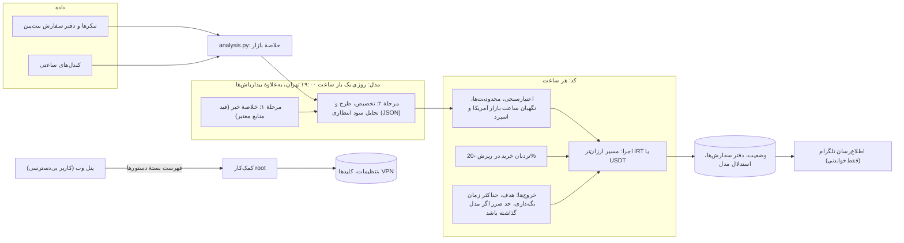

# Bitpin AI Trader

[English](README.md) · **فارسی**

ربات معامله‌گر خودکار برای صرافی ارز دیجیتال [بیت‌پین](https://bitpin.ir). این‌که حساب چه چیزی نگه دارد را یک مدل زبانی
بزرگ تصمیم می‌گیرد: به‌طور پیش‌فرض **Kimi K3** از Moonshot AI، یا هر مدلی روی **OpenRouter** یا هر سرویس سازگار با OpenAI.
کد داده‌های بازار را فراهم می‌کند، محدودیت‌های سخت را اجرا می‌کند و سفارش‌ها را می‌فرستد. هر تصمیم و هر معامله به فارسی در
**تلگرام** گزارش می‌شود و ربات با یک **پنل وب امن** و دوزبانه مدیریت می‌شود.

ربات برای مسابقهٔ **یک‌سالهٔ** معامله‌گری هوش مصنوعی بیت‌پین ساخته شده است: از بامداد ۳۱ شهریور ۱۴۰۵ به وقت تهران
(2026-09-21 ساعت 20:30 UTC) تا پایان ۳۰ شهریور ۱۴۰۶ (2027-09-21 ساعت 20:30 UTC)، و امتیاز هر حساب ارزش آن به تومان است. هدف،
بیشترین ارزش حساب در پایان سال است، با ریسکی که این هدف دارد: مدل تصمیم‌گیر می‌ماند و کد نظم و استحکام اضافه می‌کند.

| | |
|---|---|
| **نسخه** | `3.11.0` · تغییرات هر نسخه در [CHANGELOG.md](CHANGELOG.md) |
| **اجرا** | روی یک سرور Ubuntu، به‌صورت سه سرویس systemd مستقل |
| **وابستگی** | هیچ؛ فقط کتابخانهٔ استاندارد پایتون (Python 3.7 تا 3.14) |
| **تست** | حدود ۱۵۰۰ تست واحد و یکپارچه؛ بدون نیاز به شبکه یا کلید واقعی |
| **مجوز** | [MIT](LICENSE) |

> [!WARNING]
> **این نرم‌افزار با پول واقعی معامله می‌کند.** هیچ بخشی از آن توصیهٔ سرمایه‌گذاری نیست و مسئولیت استفاده با خودتان است.
> کلیدهای API و توکن‌ها هرگز در این ریپو نیستند. روی سرور در فایل‌هایی زیر `/etc/bitpin-bot/` نگه‌داری می‌شوند که فقط root
> می‌تواند بخواند.

## امکانات

- **روزی یک تصمیم**، ساعت ۱۹:۰۰ به وقت تهران (۱۵:۳۰ UTC، داخل ساعت کار بازار سهام آمریکا). بین دو تصمیم، ربات در این موارد
  هم بیدار می‌شود:
  - حرکت ±۱۲٪ یک دارایی در دست؛
  - بیشتر شدن افت سرمایه؛
  - پر شدن یک سفارش نردبان، یا ریزش ۱۵٪ یک کوین نردبان (مدل می‌تواند سفارش‌های آن را لغو کند)؛
  - تصمیم پایانی مسابقه، ۲۹ شهریور ۱۴۰۶ (2027-09-20) ساعت ۱۳:۰۰ تهران.
- **دو مرحلهٔ مدل.**
  - *خبر:* ربات تیترهای تازهٔ فهرستی از سایت‌های معتبر را از فید خودشان (RSS، Atom) می‌خواند: خبرگزاری‌ها، رسانه‌های
    کریپتو، رسانه‌های اقتصادی ایران و منابع رسمی (در پنل قابل ویرایش). یک مدل خبرهای مهم را انتخاب و در یک درخواست JSON
    خلاصه می‌کند؛ لینک و تاریخ هر خبر از خود فید است و خبرهای کهنه‌تر از یک هفته کنار گذاشته می‌شوند. این خلاصه متن
    نامطمئن حساب می‌شود: قیمت‌ها و دستورهای جاسازی‌شده از آن حذف می‌شوند.
  - *تصمیم:* مدل تصمیم یک تخصیص JSON سخت‌گیرانه برمی‌گرداند. هر ورود تازه یک طرح دارد (ستاپ، افق زمانی، حد ابطال، و در
    صورت نیاز هدف سود یا حد ضرر) و یک تحلیل سود انتظاری بعد از هزینه‌ها؛ هر کوینِ تحلیل‌شده هم یک خوانش تکنیکال با روش
    ثابت (روند، مومنتوم، RSI، بولینگر، دانچیان، حجم، حمایت و مقاومت) دارد که کد روی همان عددها دوباره بررسی می‌کند.
- **۵۳ بازار:** تتر، ۳۴ کوین پرحجم و ۱۸ توکن دارایی واقعی (طلا، نقره، نفت، گاز، معدن مس، سهام آمریکا، و ETFهای سهام و
  اوراق آمریکا). توکن‌های سهام، ETF و صندوق‌های کالایی فقط وقتی بازار آمریکا باز است (دوشنبه تا جمعه ۱۳:۳۰ تا ۲۰:۰۰ UTC؛
  در زمستان آمریکا یک ساعت دیرتر) و با اسپرد زیر ۱٪ خریده می‌شوند. توکن‌های طلای PAXG و XAUT شبانه‌روزی‌اند.
- **داده‌های تکنیکال** برای هر بازار، بر پایهٔ قیمت تتری: بازده، نوسان (ATR)، RSI، فاصله از EMA، جای قیمت در دامنهٔ ۳۰
  روزه، MACD، باند بولینگر، کانال دانچیان ۲۰ کندلی و سطح‌های حمایت و مقاومت از نقطه‌های چرخش ۴ ساعتهٔ ۳۰ روز اخیر. در سطح
  سبد: بتا و همبستگی وزنی با بیت‌کوین.
- **اجرا:** هر معامله از مسیر ارزان‌تر انجام می‌شود (`COIN_IRT` + `USDT_IRT`، یا مستقیم `COIN_USDT`)، اندازه‌اش با دفتر
  سفارش زنده و محافظ لغزش سنجیده می‌شود و در دفتر سفارش‌ها ثبت می‌شود تا بعد از هر قطعی بی‌خطر بازیابی شود.
- **نردبان خرید در ریزش:** سفارش‌های خرید maker که در سطح -20% نسبت به سقف ۴۸ ساعته منتظر می‌مانند، با اندازه‌ای که مدل
  برای هر کوین تعیین می‌کند.
- **خروج‌هایی که کد اجرا می‌کند:** هر موقعیت حداکثر زمان نگه‌داری دارد (تا ۷۲۰ ساعت) و سطح‌های بیدارباش؛ خریدهای نردبان
  هدف سود خودکار می‌گیرند؛ هدف یا حد ضرر دیگر فقط وقتی هست که مدل برای همان موقعیت گذاشته باشد.
- **محافظ‌هایی که مدل نمی‌تواند دور بزند:**
  - اعتبارسنجی سخت‌گیرانهٔ JSON و نمادهای مجاز، و حداقل اندازهٔ سفارش؛
  - کوینی که در ۲۴ ساعت ۳۰٪ یا بیشتر بالا رفته خریده نمی‌شود؛
  - حداقل زمان نگه‌داری، و تا ۲۴ ساعت بعد از حد ضرر خرید دوباره ممنوع؛
  - نگه‌داشتن تا شکست سطح ابطال (۳٫۱۱): موقعیتی که برنامهٔ مدل را دارد فقط با بسته‌شدن ساعتی زیر سطح ابطال، رسیدن به هدف
    یا تیتر خبری دربارهٔ همان کوین فروخته می‌شود، نه با تمام شدن مهلت برنامه؛ و بعد از فروش با حد ضرر یا تصمیم، همان کوین
    تا ۷۲ ساعت دوباره خریده نمی‌شود مگر ۳٪ ارزان‌تر شده باشد؛
  - توقف معاملات در افت ۵۰٪ از بالاترین ارزش حساب در ۹۰ روز اخیر؛
  - کلید توقف اضطراری `STOP`؛
  - از ۲۵ شهریور ۱۴۰۶ (2027-09-16)، پنج روز پیش از پایان، ورود تازه ممنوع است؛
  - وقتی مدل در دسترس نیست، پول به تتر منتقل می‌شود.
- **کنترل هزینه:** بودجهٔ روزانهٔ فراخوان و توکن برای هر مرحلهٔ مدل و شمارندهٔ زندهٔ هزینهٔ دلاری. اطلاع‌رسان وقتی اعتبار
  سرویس مدل تمام شود هشدار می‌دهد. با تنظیمات پیش‌فرض، هزینهٔ مدل چند دلار در ماه است.

## یک تصمیم چطور گرفته می‌شود



## سه سرویس

| سرویس | کاربر | کار | اگر بایستد |
|---|---|---|---|
| `bitpin-bot` | `bitpin` | معامله‌گر: داده‌های بازار، فراخوانی مدل، سفارش‌ها، خروج‌ها | معامله می‌ایستد؛ سفارش‌های منتظر روی بیت‌پین می‌مانند |
| `bitpin-bot-notify` | `bitpin` | فایل‌های معامله‌گر را می‌خواند و در تلگرام گزارش می‌دهد؛ به `/status`، `/last` و `/stop` جواب می‌دهد | فقط پیام‌ها قطع می‌شوند |
| `bitpin-bot-panel` | `bitpin-panel` | پنل مدیریت HTTPS؛ کارهای نیازمند root از راه `bitpin-bot-panel-helper` انجام می‌شوند (برای هر درخواست یک پردازهٔ جدا) | فقط پنل از دسترس خارج می‌شود |

معامله‌گر مستقیم به بیت‌پین وصل می‌شود، از IP سروری که برای کلید API در لیست سفید است. ترافیک مدل و تلگرام می‌تواند از یک
پراکسی HTTP محلی بگذرد (`KIMI_HTTPS_PROXY`، `TELEGRAM_HTTPS_PROXY`).

## پنل مدیریت

یک صفحهٔ HTTPS روی سرور خودتان که از هر جا با **نام کاربری، رمز قوی و کد ۶ رقمی برنامهٔ احراز هویت** باز می‌شود. **فارسی و
انگلیسی** است (دکمهٔ زبان در همهٔ صفحه‌ها؛ تا زبانی انتخاب نشود، زبان مرورگر تعیین می‌کند)، حالت روشن یا تیرهٔ دستگاه را
دنبال می‌کند و روی گوشی هم کار می‌کند. تا راه‌اندازی نشود خاموش است:

```bash
sudo bitpin-bot panel-setup        # کاربر، رمز، ورود دومرحله‌ای، گواهی خودامضا و اثر انگشتش؛ پنل را روشن می‌کند
sudo bitpin-bot panel-cert panel.example.com   # اختیاری: گواهی معتبر Let's Encrypt برای یک دامنه
                                   # (مالکیت با DNS در Cloudflare و توکن همان دامنه)؛ خودش تمدید می‌شود
sudo ufw allow 8443/tcp            # فقط اگر ufw فعال است؛ پنل خودش هیچ پورتی باز نمی‌کند
```

| صفحه | کار |
|---|---|
| داشبورد | سرویس‌ها، ارزش حساب، سود و زیان، افت سرمایه، آخرین تصمیم با گزارشش، موقعیت‌ها، هزینه |
| عملکرد | سود و زیان هر بازهٔ زمانی به تومان و به تتر (بدون اثر افت ریال)، برای هر دارایی و در مقایسه با نگه‌داشتن تتر؛ نمودار زندهٔ سبد و هر موقعیت باز با ورود، حد ضرر، هدف و سفارش‌های باز، دو سناریوی مدل و محدودهٔ نوسان عادی آینده، و استراتژی و روش تحلیل پشت آن؛ روی نمودار هر موقعیت اندیکاتورهای خود ربات (EMA ۲۰ / ۵۰ / ۲۰۰، بولینگر، دانچیان، حمایت و مقاومت) با RSI، MACD و حجم زیر آن |
| سابقهٔ معاملات | همهٔ خریدها و فروش‌های ربات، با فیلتر، صفحه‌بندی و دانلود CSV |
| عملکرد | سود و زیان هر بازهٔ زمانی به تومان و به تتر (بدون اثر افت ریال)، برای هر دارایی و در مقایسه با نگه‌داشتن تتر؛ نمودار زندهٔ سبد و هر موقعیت باز با ورود، حد ضرر، هدف و سفارش‌های باز، دو سناریوی مدل و محدودهٔ نوسان عادی آینده، و استراتژی و روش تحلیل پشت آن؛ روی نمودار هر موقعیت اندیکاتورهای خود ربات (EMA ۲۰ / ۵۰ / ۲۰۰، بولینگر، دانچیان، حمایت و مقاومت) با RSI، MACD و حجم زیر آن؛ موقعیت‌هایی که حساب دارد جدا از کوین‌هایی که فقط سفارش منتظر دارند |
| سابقهٔ معاملات | همهٔ خریدها و فروش‌های ربات، با فیلتر، صفحه‌بندی و دانلود CSV |
| تحلیل تکنیکال | عددهای دقیق اندیکاتورهایی که ربات در آخرین تصمیم به مدل داد، خوانش مدل با روش ثابت و بررسی آن با کد |
| تنظیمات معامله | حدود ۶۰ تنظیم مهم در ۹ گروه (منابع معتبر خبر هم)، با پیش‌نمایش و مقایسه پیش از ذخیره |
| مدل‌ها و کلیدها | Moonshot، OpenRouter یا سرویس دیگر؛ فهرست مدل‌ها با قیمت؛ کلیدها فقط‌نوشتنی‌اند |
| تنظیمات (JSON) | کل `config.json` و `kimi.json`، با اعتبارسنجی پیش از ذخیره |
| اعمال | بررسی سرور، متن تأیید و عبارت تایپ‌شده، بعد توقف، تأیید، شروع و بررسی سلامت |
| VPN | وضعیت و آزمون تونل؛ جایگزینی سرور با لینک `vless` / `vmess` / `trojan` / `ss` و برگشت خودکار |
| لاگ‌ها، امنیت | لاگ سرویس‌ها؛ رمز و ورود دومرحله‌ای؛ سابقهٔ رویدادها |

راهنمای کامل: [docs/PANEL_FA.md](docs/PANEL_FA.md).

## اطلاع‌رسان تلگرام

یک سرویس جدا و فقط‌خواندنی که به فارسی پیام می‌فرستد دربارهٔ:

- هر تصمیم، با دلیل‌های مدل، خبرهایی که به کار برده و ریسک‌هایی که می‌بیند؛
- هر معامله، پر شدن سفارش‌های نردبان و خروج‌ها؛
- مشکل‌ها: در دسترس نبودن مدل یا خبر، قطعی تونل، تمام شدن اعتبار، افت سرمایه، توقف ربات، سفارش با نتیجهٔ نامعلوم؛
- ورودها و تغییرهای پنل؛
- یک خط روزانه (ارزش حساب، افت سرمایه، هزینه) و خلاصهٔ هفتگی.

به `/status` و `/last` جواب می‌دهد، و `/stop` (با تأیید دوم) توقف اضطراری است. راهنمای راه‌اندازی:
[docs/TELEGRAM_FA.md](docs/TELEGRAM_FA.md).

## امنیت

- **کلیدها** فقط در `/etc/bitpin-bot/bitpin-bot.env` و `notify.env` هستند (مالک root، دسترسی 0600) و systemd آن‌ها را
  می‌خواند. اطلاع‌رسان هرگز کلیدهای معامله را بار نمی‌کند و پنل هیچ کلیدی را نمی‌بیند. کلید بیت‌پین فقط به اجازهٔ معامله
  نیاز دارد، هرگز اجازهٔ برداشت، و بهتر است به IP سرور محدود باشد.
- **تأیید اجرای واقعی.** شروع واقعی به یک تأیید تایپ‌شده نیاز دارد (`confirm-live` با عبارت `I ACCEPT THE RISK`) که به اثر
  انگشت تنظیمات بسته است. بعد از هر تغییر در `config.json` یا `kimi.json`، سرویس تا تأیید دوباره معامله نمی‌کند: با کد ۷۸
  خارج می‌شود و تلگرام خبر می‌دهد.
- **خروجی مدل نامطمئن است.** پاسخ‌ها به‌صورت JSON سخت‌گیرانه خوانده و با بازارهای مجاز و محدودیت‌ها سنجیده می‌شوند؛ پاسخ
  نادرست یک بار برای اصلاح برمی‌گردد و بعد رد می‌شود. متن خبر پیش از رسیدن به مدل تصمیم پاک‌سازی می‌شود.
- **پنل** با کاربر بی‌دسترسی و فقط روی TLS اجرا می‌شود.
  - ورود به نام کاربری، رمز (هش‌شده با PBKDF2) و کد TOTP نیاز دارد؛ ورودهای ناموفق اول همان IP و بعد همه را قفل می‌کنند.
  - نشست‌ها کوکی `__Host-` دارند، هر فرم توکن CSRF دارد و سرآیندهای امنیتی سخت‌گیرانه تنظیم می‌شوند.
  - کارهای نیازمند root فقط از راه یک کمک‌کار انجام می‌شوند که فهرست بسته‌ای از دستورها را می‌پذیرد و هر ورودی را دوباره
    بررسی می‌کند.
  - تنظیمات پیش از ذخیره از بررسی‌های خود ربات می‌گذرند؛ هر کلید فقط به سکوی خودش فرستاده می‌شود و نشانی API بیت‌پین از
    پنل عوض نمی‌شود.
  - هر ورود و هر تغییر در تلگرام گزارش می‌شود.
- **سرور.** سندباکس systemd (NoNewPrivileges، ProtectSystem=strict، محدود کردن capabilityها)، نصب فقط‌خواندنی کد در
  `/opt/bitpin-bot` و پشتیبان روزانه از وضعیت ربات. هیچ تنظیم سراسری سرور عوض نمی‌شود.

## نصب و به‌روزرسانی

سیستم لازم: Ubuntu 22.04 یا 24.04 با Python 3، systemd و دسترسی root. راهنمای گام‌به‌گام همهٔ مراحل، چک‌لیست ماهانه و
عیب‌یابی را دارد: [docs/DEPLOY_FA.md](docs/DEPLOY_FA.md).

### نصب

```bash
# روی سرور، از یک کپی این ریپو بیرون از /opt/bitpin-bot
git clone REPO_URL ~/bitpin-bot-src && cd ~/bitpin-bot-src
sudo bash deploy/install.sh              # کد در /opt/bitpin-bot، کاربر bitpin، واحدهای systemd و دستور bitpin-bot
sudo nano /etc/bitpin-bot/bitpin-bot.env # BITPIN_API_KEY، BITPIN_SECRET_KEY، KIMI_API_KEY (یا OPENROUTER_API_KEY)
sudo bitpin-bot check                    # تنظیمات، IP عمومی برای لیست سفید، دسترسی‌ها، ساعت
sudo bitpin-bot status                   # موجودی‌ها؛ یک بار موجودی تومانی را تأیید کنید
sudo bitpin-bot kimi-check --news        # کلید مدل، مسیر و یک فراخوان آزمایشی واقعی
sudo bitpin-bot confirm-live             # تایپ کنید: I ACCEPT THE RISK
sudo systemctl enable --now bitpin-bot
sudo bitpin-bot health
```

- IP بیرونی سرور را برای کلید API بیت‌پین در لیست سفید بگذارید؛ `check` آن را نشان می‌دهد.
- تنظیمات واقعی فقط در `/etc/bitpin-bot/` نگه‌داری می‌شوند و `install.sh` فایل موجود را بازنویسی نمی‌کند.
- `deploy/lib.sh` هنگام کپی به `/opt/bitpin-bot` فقط چیزهای لازم را می‌برد. پوشهٔ `.git` و `scratch/`، فایل‌های کلید
  (`*.env`، `api.txt`، `*.key`)، `scripts/kimi_check.py` و پوشه‌های توسعهٔ `research/`، `docs/dev_notes/` و `docs/reviews/`
  کنار گذاشته می‌شوند.
- همیشه بیرون از `/opt/bitpin-bot` clone کنید. پیش از `deploy/update.sh` هم باید `git status --short` خالی باشد، چون کپی از
  درخت کاری گرفته می‌شود، نه از commit.
- پیش از اجرای واقعی می‌توانید همین ربات را با پول مجازی اجرا کنید: `sudo systemctl start bitpin-bot-paper`.

### به‌روزرسانی

```bash
# روی سرور، از پوشهٔ کد تازه (بیرون از /opt/bitpin-bot)
sudo bash deploy/update.sh               # کپی جدا، تست‌ها، بررسی تنظیمات، جابه‌جایی، راه‌اندازی دوباره
sudo bitpin-bot health
```

`update.sh` فقط سرویس‌هایی را که روشن بودند دوباره روشن می‌کند و اگر کد تازه بالا نیاید، خودش به نسخهٔ قبل برمی‌گردد. زیر
ربات واقعیِ روشنی که تأییدش با نسخهٔ تازه نمی‌خواند، کد را عوض نمی‌کند.

### مسیر به‌روزرسانی

وقتی یادداشت یک نسخه در CHANGELOG.md می‌گوید رفتار معامله یا تنظیمات عوض شده است، این ترتیب را دنبال کنید:

```bash
# بستهٔ انتشار: git archive --format=tar.gz -o bitpin-bot-release-v3.tgz HEAD (یا git pull در clone سرور)
rm -rf ~/bitpin-bot-src-new && mkdir ~/bitpin-bot-src-new
tar -xzf ~/bitpin-bot-release-v3.tgz -C ~/bitpin-bot-src-new
sudo systemctl stop bitpin-bot                          # سفارش‌های منتظر نردبان روی بیت‌پین می‌مانند؛ کوتاه نگه دارید
cd ~/bitpin-bot-src-new && sudo bash deploy/update.sh
sudo python3 /opt/bitpin-bot/deploy/apply_profile.py    # پروفایل تنظیمات نسخه؛ اول پشتیبان می‌گیرد و دستور برگشت را چاپ می‌کند
sudo bitpin-bot check
sudo bitpin-bot confirm-live
sudo systemctl start bitpin-bot
sudo bitpin-bot health
```

برگشت به نسخهٔ قبلی: `sudo bash /opt/bitpin-bot/deploy/update.sh --rollback` و بعد دوباره `confirm-live`. اگر
`apply_profile.py` تنظیمات را عوض کرده بود، اول نسخه‌های `*.before-profile` را از `/var/backups/bitpin-bot` برگردانید.
جزئیات در [docs/DEPLOY_FA.md](docs/DEPLOY_FA.md).

## تنظیمات

| فایل (روی سرور) | محتوا |
|---|---|
| `/etc/bitpin-bot/config.json` | اجرا و ریسک: کارمزدها، حداقل سفارش، توقف در افت (`risk.max_drawdown` برابر 0.50 و `hwm_window_days` برابر 90)، نردبان، خروج‌ها، مسیرها |
| `/etc/bitpin-bot/kimi.json` | مرحله‌های مدل (`llm` و `news`)، مغز (زمان‌بندی، بیدارباش‌ها، بازارهای مجاز، سبک، پایان مسابقه)، خلاصهٔ بازار، محافظ پامپ |
| `/etc/bitpin-bot/bitpin-bot.env` | رازها: جفت کلید بیت‌پین، کلیدهای مدل، `KIMI_HTTPS_PROXY` |
| `/etc/bitpin-bot/notify.json`، `notify.env` | تنظیمات اطلاع‌رسان؛ توکن تلگرام و شناسهٔ گفت‌وگو |
| `/etc/bitpin-bot-panel/panel.json` | پنل: پورت، نام کاربری، **هش** رمز، راز TOTP |

هر کلید در فایل `*.example.json` هم‌نامش، کنار مقدارش توضیح داده شده است. کلیدهای ناشناخته رد می‌شوند تا غلط تایپی جا
نماند. هر تغییر بعد از `sudo bitpin-bot check`، `confirm-live` و راه‌اندازی دوباره اثر می‌کند؛ پنل هر سه را برایتان انجام
می‌دهد.

## OpenRouter یا مدل‌های دیگر

1. در openrouter.ai یک کلید بسازید و اعتبار بخرید.
2. در پنل (مدل‌ها و کلیدها) **OpenRouter** را انتخاب کنید و کلید را با نام `OPENROUTER_API_KEY` ذخیره کنید.
3. فهرست مدل‌ها را بار کنید و یک مدل (مثلاً `moonshotai/kimi-k3`) برای مرحلهٔ تصمیم و اگر خواستید برای مرحلهٔ خبر انتخاب
   کنید. قیمت‌ها خودکار در شمارندهٔ هزینه ثبت می‌شوند.
4. ذخیره کنید و بعد **اعمال** را بزنید.

همین کار با دست، در `kimi.json`:

```json
"llm": {
  "provider": "openrouter",
  "base_url": "https://openrouter.ai/api/v1",
  "api_key_env": "OPENROUTER_API_KEY",
  "model": "moonshotai/kimi-k3"
}
```

در OpenRouter میزان استدلال به‌صورت `reasoning.effort` فرستاده می‌شود، مصرف و هزینه در همان جریان پاسخ برمی‌گردد و خطای
HTTP 402 (نبود اعتبار) مثل تمام شدن اعتبار Moonshot گزارش می‌شود. در روش «جست‌وجو» مرحلهٔ خبر از افزونهٔ وب OpenRouter استفاده می‌کند؛ روش پیش‌فرض «فید» فقط جواب JSON لازم دارد. هر
سرویس سازگار با OpenAI هم با `provider: "openai"` و کلید `LLM_API_KEY` کار می‌کند؛ این کلید به همان نشانی‌ای بسته است که
با آن ذخیره شده است.

## دستورهای روزمره

```bash
sudo bitpin-bot health              # همه‌چیز روشن است؟ آخرین تصمیم، بودجهٔ سفارش؛ خط آخر: RESULT: OK
sudo bitpin-bot logs                # دنبال کردن لاگ معامله‌گر
sudo bitpin-bot decisions 3         # سه تصمیم آخر (JSON)
sudo bitpin-bot ladder              # سفارش‌های نردبان، فقط خواندن
sudo bitpin-bot stop                # کلید توقف: ربات سفارش‌های نردبانش را لغو می‌کند و خارج می‌شود
sudo bitpin-bot resume              # برداشتن کلید توقف (بعد سرویس را روشن کنید)
sudo bitpin-bot confirm-live --check
sudo bitpin-bot panel-status        # نشانی پنل، گواهی (صادرکننده، پایان، تمدید)، ورود دومرحله‌ای
sudo bitpin-bot help                # بقیهٔ دستورها
```

## اجرای تست‌ها

همان دستوری که `deploy/update.sh` پیش از هر به‌روزرسانی اجرا می‌کند:

```bash
PYTHONDONTWRITEBYTECODE=1 TZ=UTC python3 -m unittest discover -s tests
```

روی Python 3.14 و 3.7 سبز نگه داشته می‌شود. چند تست فقط روی لینوکس اجرا می‌شوند (symlink، FIFO، اسکریپت‌های bash) و جای
دیگر رد می‌شوند. هیچ تستی به شبکه یا کلید واقعی دست نمی‌زند: صرافی و مدل در تست‌ها جعلی‌اند.
`tests/test_prompt_template.py` همهٔ ترکیب‌های prompt را می‌سازد و بررسی می‌کند.

## ساختار ریپو

| مسیر | محتوا |
|---|---|
| [`bitpin/`](bitpin) | پکیج پایتون ربات (جدول پایین) |
| [`scripts/`](scripts) | نقطه‌های ورود: `run_bot.py` (خط فرمان ربات)، `notify_bot.py`، `panel_server.py`، `panel_helper.py`، `panel_setup.py` و ابزارهای پژوهش |
| [`deploy/`](deploy) | `install.sh`، `update.sh`، `uninstall.sh`، واحدهای systemd، دستور مدیریت `bitpin-bot`، بررسی سرور، پروفایل تنظیمات |
| [`tests/`](tests) | تست‌های واحد و یکپارچه با صرافی و مدل جعلی |
| [`docs/`](docs) | راهنماهای گام‌به‌گام فارسی (نصب، تلگرام، پنل) و دانش راهبردی که به مدل داده می‌شود |
| [`data/`](data) | رتبه‌بندی بازارها بر اساس حجم (کندل‌ها با `scripts/fetch_data.py` دانلود می‌شوند) |
| `*.example.json` | نمونهٔ تنظیمات با توضیح: `config` (ریسک و اجرا)، `kimi` (مدل‌ها، prompt، زمان‌بندی)، `news`، `notify` |
| [`CHANGELOG.md`](CHANGELOG.md) | همهٔ نسخه‌ها: خلاصهٔ فارسی با جزئیات انگلیسی |

| ماژول | کار |
|---|---|
| `api.py` | کلاینت REST بیت‌پین: ورود و تازه کردن توکن، سفارش‌ها، کیف پول، بودجهٔ ورود |
| `markets.py` | اطلاعات بازارها، حساب با Decimal، عمق دفتر سفارش، انتخاب مسیر ارزان‌تر (IRT یا USDT) |
| `broker.py` | `PaperBroker` (شبیه‌سازی روی دفتر سفارش زنده) و `LiveBroker` (سفارش واقعی market و limit، دفتر سفارش‌ها) |
| `risk.py` | بررسی‌های پیش از سفارش، سقف غلتان ارزش حساب و توقف در افت، بودجهٔ سفارش |
| `runner.py` | حلقهٔ ساعتی: زمان‌بندی تصمیم، تخصیص، نردبان، خروج‌ها، محافظ‌ها، پایان مسابقه، کلید توقف |
| `brain.py`، `prompt_template.txt` | prompt مدل، قرارداد JSON و اعتبارسنجی آن، طرح‌های ورود، حالت‌های بیدارباش، جایگزین |
| `llm.py` | کلاینت سازگار با OpenAI (Moonshot، OpenRouter و دیگران): جریان پاسخ، تلاش دوباره، میزان استدلال، بودجه‌ها، فهرست مدل‌ها با قیمت |
| `news.py`، `news_feeds.py` | مرحلهٔ ۱: فید منابع معتبر (یا جست‌وجوی وب) و خلاصهٔ پاک‌سازی‌شدهٔ اخبار |
| `analysis.py` | خلاصهٔ بازار: نوسان، افت‌ها، اندیکاتورها، حمایت و مقاومت، بتا و همبستگی، اسپرد و عمق، کلاس دارایی، ساعت بازار آمریکا |
| `notify.py` | اطلاع‌رسان تلگرام (فارسی) |
| `panel_web.py`، `panel_auth.py`، `panel_settings.py`، `panel_i18n.py`، `static/` | پنل وب: صفحه‌ها، ورود و نشست‌ها، فرم تنظیمات معامله، ترجمهٔ فارسی، استایل |
| `performance.py` | گزارش سود و زیان پنل: جمع به تومان و تتر، ردیف هر دارایی، دادهٔ نمودارها، سابقهٔ معاملات |
| `technical.py` | خوانش تکنیکال با روش ثابت: قاعده‌ها، بررسی خوانش مدل، دادهٔ صفحهٔ تحلیل تکنیکال پنل |
| `vpn.py` | لینک‌های اشتراک VPN به کانفیگ xray، پوشاندن اطلاعات محرمانه، آزمون xray و پراکسی |
| `spend.py` | شمارندهٔ هزینهٔ دلاری فراخوانی‌های مدل |
| `data.py`، `indicators.py`، `backtest.py`، `research.py`، `strategies/` | کندل‌ها، اندیکاتورها، بک‌تست بدون نگاه به آینده و استراتژی‌های قاعده‌محوری که آزموده شدند |

## خلاصهٔ پژوهش

طراحی از مطالعه‌های آفلاین روی تاریخچهٔ قیمت خود بیت‌پین آمده است، با یک دورهٔ آموزش و یک دورهٔ بعدیِ دیده‌نشده. کد و دادهٔ
این مطالعه‌ها در این ریپو نیست؛ نرخ‌های پایه‌ای که به مدل داده می‌شود در
[docs/STRATEGY_KNOWLEDGE.md](docs/STRATEGY_KNOWLEDGE.md) است.

- هیچ استراتژی قاعده‌محوری روی ۱۵۰ روز دیده‌نشده، بعد از هزینه‌ها، از نگه‌داشتن سادهٔ تتر بهتر نبود.
- زیر افق ۱۲ تا ۲۴ ساعت، هیچ سیگنال زمان‌بندی‌ای هزینهٔ رفت‌وبرگشت را جبران نکرد؛ برای همین ربات روزی یک بار تصمیم
  می‌گیرد، نه هر ساعت.
- خرید بعد از پامپ ۳۰٪ یا بیشتر در همهٔ ماه‌های بررسی‌شده ضرر داد (۲۴ ساعت بعد: میانگین −۶٪ و میانه −۸٪). نتیجه‌اش محافظ
  پامپ است.
- برگشت قیمت بعد از ریزش ۲۰٪ یا بیشتر در دورهٔ آموزش مثبت بود ولی بعدتر شکننده بود؛ برای همین نردبان از سفارش‌های maker
  ازپیش‌گذاشته استفاده می‌کند و اندازه‌اش را مدل تعیین می‌کند.
- در ۴۵۰ پنجرهٔ یک‌ساله، حد ضرر ثابت خالص منفی بود، توقف در ۳۰٪ در همهٔ پنجره‌ها فعال می‌شد و توقف در ۵۰٪ هرگز، نگه‌داری
  تا ۳۰ روز از ۷ روز بهتر بود و طلا سبد را متنوع کرد. این نتیجه‌ها محدودیت‌های نسخهٔ ۳ را تعیین کردند.
- جای حد ضرر (زیر حمایت، زیر کف دانچیان یا ۵٪ ثابت) در میانگین پلان‌ها فرق معناداری نکرد، ولی هر حد ضرری بدترین پلان را
  از حدود ۲۶ تا ۳۱ درصد ضرر به ۱۰ تا ۱۹ درصد رساند. نزدیک‌ترین حد ضرر (۲×ATR) در بیش از نیمی از پلان‌ها زده شد و بدترین
  بود، و هدف روی مقاومت بهتر از هدف ثابت نبود. برای همین مقاومت به مدل «جایی که قیمت ممکن است بایستد» معرفی می‌شود، نه
  سقف هدف.
- آزمودن دوبارهٔ هر روزهٔ کوینِ در دست (یا در پایان مهلت برنامه) با شرط ورود، سالی ۱۵ تا ۲۳ رفت‌وبرگشت برای هر کوین ساخت؛
  نگه‌داشتن تا شکست سطح ابطال حدود ۸ رفت‌وبرگشت داشت و هم در دورهٔ آموزش و هم در دورهٔ بعد بازده بیشتری داد (۱۱۱ پنجرهٔ
  ۹۰ روزه). بالا بردن سطح ابطال همراه قیمت این برتری را از بین برد، مکث ۷۲ ساعته پس از فروش بیمه‌ای ارزان بود و حاشیهٔ
  اضافه روی سود مورد انتظار نتیجهٔ دوگانه داشت. قانون نگه‌داشتن نسخهٔ ۳٫۱۱ از همین آمد.

## مجوز

[MIT](LICENSE). نرم‌افزار همان‌طور که هست و بدون هیچ ضمانتی عرضه می‌شود؛ معامله با آن به مسئولیت خودتان است.
